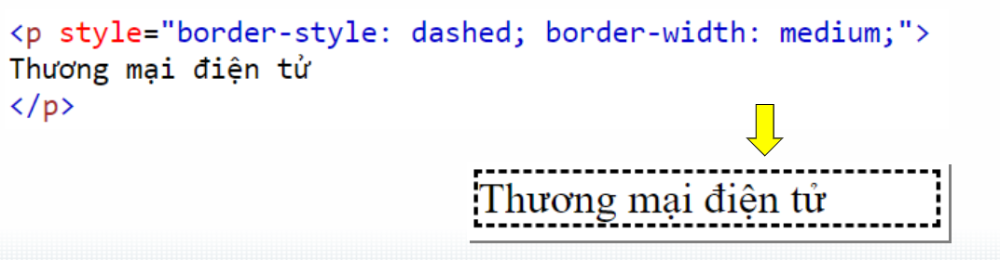
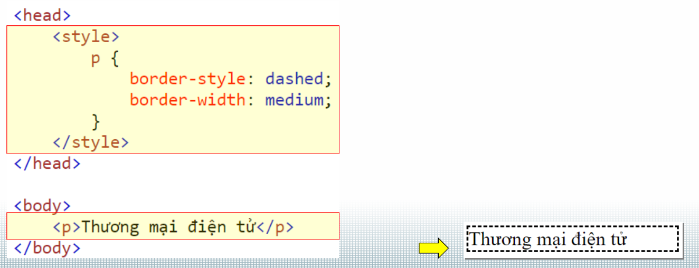

* đơn vị
    đơn vi tuyệt đối : kh phụ thuộc vào xung quanh
    dvi tương đối; phụ thuộc vd nằm trong 1 ô ô to thì to ra, ô nhỏ thì nó nhỏ lại

------------------------CHỖ ĐỂ STYLE CSS---------------------------------------
* inline
    nhúng code CSS trực tiếp vào dòng html 
    thường dùng đơn lẻ

* Internal 
    - Được nhúng trong thẻ <style>, đặt trong khối <head> ... </head> 
    dưới body dùng thẻ j, trên style dùng thẻ đó thì mới theo style trên, thẻ khác sẽ h theo style đs (thông qua thành phần) <h> 
 

    - Nhúng CSS thông qua thuộc tính id: Sử dụng trong trường hợp cùng một thẻ thành phần nhưng có nhiều định dạng 
    khác nhau
    khai báo trong style !idname 
    ![alt text] 

* padding: là khoảng cách giữa nd bên trong và viền ngoài 
* margin: kcach bên ngoài (ptu vs ben ngoài)

* display:
    -  display: block ptu chiếm toàn bộ chiều rộng có sẵn, có thể bđ trên dòng mới
    - inline: chiếm chiều rộng cần thiết, kh bđ trên dòng mới, kh có chiều cao,rộng. Lề và đệm chỉ ảnh hưởng đến không gian ngang.
    - flex: Các phần tử con của container flex có thể được căn chỉnh và phân phối theo các thuộc tính khác nhau.

* font-size: dùng vw để có tương thích

-----------------------------THUỘC TÍNH CỦA FLEX-CONTAINER------------------------
* flex-wrap: cho phép items xún dòng khi kích thước container thay đổi
    - display: flex
    - flex-wrap: nowrap
        ---> cùng 1 dòng dù kích thước có ntn
    - display: flex
    - flex-wrap: wrap-reverse
        ---> xún dòng nhưng reverse

* justify-content: canh lề hiển thị các item the trục main-asix
    - center/space-between/space-around/flex-end/space-evenly

* align-items: canh lề hiển thị theo trục cross-axis (slide16 css.part2)
    - center/...giống cái trên

* align-content: canh lề cho cả khối container

-----------------------------------THUỘC TÍNH CỦA FLEX-IETMS--------------------------
* order: thứ tự hiển thị vd:2,5,3,1,4 ; nếu kh để gì thì default là 0

* flex-grow: tăng trưởng so vs cái items khác, sử dụng khi tổng kích thước item nhỏ hơn container

* flex-shrink: ngc vs grow, ni hén teo lại

* flex-basis: thiết lập kthuoc của item

* align-self: canh lề hiển thị của items 

* thuộc tính chứa display: flex chính là container

-------------------------------GRID------------------
- gộp column hay row: row thì thay colume=row
    - grid-column-start:2
    - grid-colume-end: 4
    == grid-column: 2/4

- grid-template-columns: cho phép điều chỉnh hiển thị của cột
    + vd: grid-template-columns: auto auto auto
            grid-template-columns: 20% 30% 50%
- gap: khoảnh cách giữa các cột/hàng (column-gap, row-gap, gap)
    gap: 20px 20px theo thứ tự là trên dưới trái phải

-----------------GRID--------------
* display: grid

* grid-template-columns: auto (tự động cân bằng), 
    - nếu nhiều colume quá thì dùng REPEAT(SỐ, 1FR) ---> 1fr: chia đều theo số
    tương tự như row

* gap: khcach giữa các row và column

* dùng padding nếu mún tạo khcach xung quanh

* grid-area: row start/col start/ row end/ col end